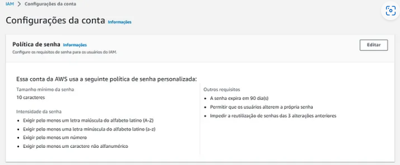

# Migra-ao-IAM
Migração de usuários de forma automatizada e gerenciamento dos recursos do IAM (Identity and Access Management) da AWS.

Nesse projeto baseado em um cenário real, tive que atuar como Especialista Cloud para realizar a migração de usuários de forma automatizada e gerenciar os recursos do IAM (Identity and Access Management) da AWS.

Haviam 100 usuários que precisaram ser migrados e ter o MFA — Autenticação por múltiplos fatores (Multi-factor Authentication) habilitado nas contas, pois esta é uma melhor prática de segurança.

Para não ser uma tarefa repetitiva e manual na console da AWS, precisei ter o pensamento voltado a automatizar os processos.

Essa é a arquitetura usada no projeto:

Para executar o projeto foi necessário executar um script no AWS CloudShell para automatizar o processo.

Os passos foram:

1º Criar todos os 5 Grupos que serão utilizados dentro do AWS.

2º Adicionar as permissões nos grupos que cada grupo terá.

3º Ajustar o arquivo .csv onde contém as informações dos usuários que será usado no script de automação.

4º No AWS CloudShell fazer o upload do script e dos .csv que será usado, e executar o script para que sejam criados os usuários e adicionados nos grupos que pertencem.

5º Aumentar a segurança da conta ativando o MFA e definindo as regras de senha para cada usuário.

Após isso a migração está concluída, todos os 100 usuários estão na AWS e em seus respectivos Grupos.

O interessante desse projeto foi como pude aprender de fato como fazer uma migração de um ambiente on-primese para a nuvem, abordou pontos importantes como a criação de grupos, aplicação de políticas a eles e como melhorar a segurança das contas utilizando MFA — Autenticação por múltiplos fatores (Multi-factor Authentication).
